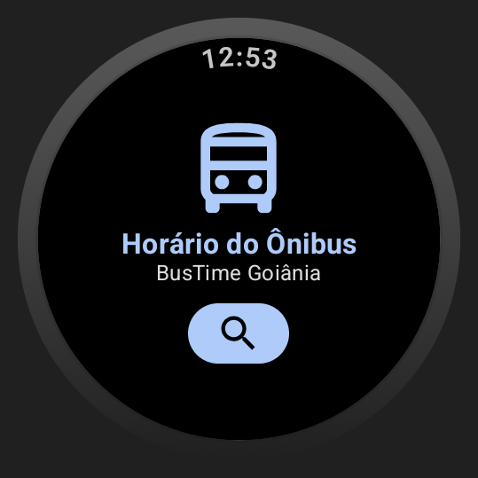
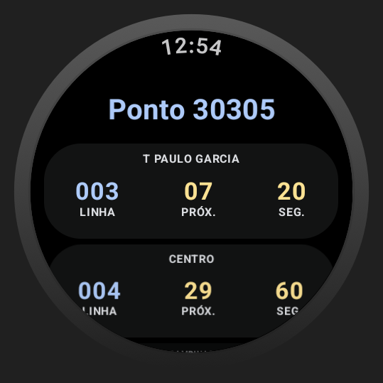

# BusTime Goiânia

Wear OS app para consulta de horários de ônibus em Goiânia - GO.

## ✨ Funcionalidades

- 🚌 Busque qualquer ponto de ônibus da cidade
- ⏰ Veja horários dos próximos ônibus em tempo real
- 📍 Navegação simples no seu relógio
- ⚡ Rápido e fluido - feito pro Wear OS

## ⌚ App Wear OS Nativo

- 📲 Não depende do celular
- 🤖 Segue o Material Design 3
- 👑 Suporta coroa giratória

## 🛣️ Como usar

1. Toque no ícone de busca
2. Digite o número do ponto
3. Veja os ônibus chegando!

## 📱 Telas

  

## 📍 Sobre

Horários via API oficial de transporte público. Goiânia - GO
